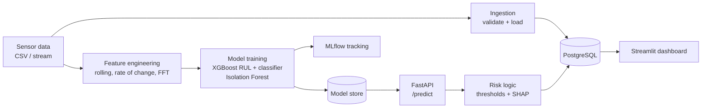

# Predictive Maintenance System

End-to-end machine learning system that predicts industrial equipment failures from multi-sensor time series data, serves predictions through a FastAPI, and gives operations teams a live fleet dashboard with configurable alerts.

## Problem

Unplanned equipment downtime is expensive, and fixed-schedule maintenance wastes effort on healthy machines. Maintenance teams need to know **which machines are likely to fail soon, how much life they have left, and why the system thinks so**, early enough to schedule repairs.

This project turns raw sensor streams into that answer:

- **Predicted Remaining Useful Life (RUL)** in cycles, so work can be planned.
- **Failure-window probability** (will it fail within 30 cycles?), a stable trigger for alerts.
- **Anomaly detection** for behavior that matches no known failure pattern.
- **SHAP explanations** for every prediction, so an engineer can see which sensor signals drove the risk score.

## Features

| S.No | Feature | Implementation |
|---|---------|----------------|
| 1 | Sensor ingestion pipeline (multi-sensor, multi-machine) | Schema validation and bulk load into PostgreSQL |
| 2 | Time series feature engineering | Rolling mean/std/min/max/slope over 3 windows, rate of change, FFT dominant magnitude and spectral energy (90 features) |
| 3 | Failure prediction | XGBoost RUL regressor and failure-window classifier |
| 4 | Anomaly detection | Isolation Forest trained on healthy operation only |
| 5 | Explainability | SHAP TreeExplainer, top drivers returned with each prediction |
| 6 | Real-time serving | FastAPI `/predict` endpoint |
| 7 | Alerting | Configurable thresholds mapped to OK / WATCH / WARNING / CRITICAL |
| 8 | Operations dashboard | Streamlit: fleet risk overview, sensor trends, prediction history, alert log |
| 9 | Experiment tracking | MLflow logs parameters, metrics, and model artifacts per run |

## Architecture



## Tech stack

| Layer | Tools |
|-------|-------|
| Data processing | pandas, NumPy |
| Feature engineering | Custom rolling-window and FFT functions |
| Modeling | XGBoost, scikit-learn (Isolation Forest) |
| Explainability | SHAP |
| API | FastAPI, Pydantic, Uvicorn |
| Database | PostgreSQL (SQLAlchemy) |
| Dashboard | Streamlit, Plotly |
| Experiment tracking | MLflow |
| Infrastructure | Docker Compose |

## Dataset

The project uses **synthetic run-to-failure data**, generated by `data/generate_synthetic_data.py` (fixed seed, fully reproducible). It is not real plant data.

- 40 machines across 4 types (pump, compressor, motor, conveyor)
- About 10,900 hourly readings, 150 to 400 cycles per machine
- 5 sensors: vibration, temperature, pressure, RPM, current
- Each machine drifts from healthy to failure with rising noise, loosely modeled on the shape of NASA C-MAPSS degradation data
- 4 machines have an atypical failure shape so the anomaly detector has something novel to catch

## Results

Evaluated on **held-out machines** (the train/test split is by machine, not by row, so no machine's lifetime leaks into both sets).

| Metric | Value |
|--------|-------|
| RUL regression, MAE | about 35 cycles |
| Failure-window classifier, ROC AUC | 0.999 |
| Failure-window classifier, precision / recall | 0.85 / 0.99 |

## Alert logic

| State | Condition |
|-------|-----------|
| CRITICAL | Predicted RUL <= 20 cycles, or failure probability >= 0.70 |
| WARNING | Predicted RUL <= 60 cycles, or failure probability >= 0.40 |
| WATCH | Anomaly flagged, no threshold breached |
| OK | Within normal operating range |

WARNING and CRITICAL predictions are also written to the `alerts` table.

## Project structure

```
predictive-maintenance-system/
├── data/
│   ├── generate_synthetic_data.py
│   └── sample/
├── src/
│   ├── config.py
│   ├── ingestion/pipeline.py
│   ├── features/engineering.py
│   ├── models/
│   │   ├── train_rul.py
│   │   └── anomaly_detection.py
│   ├── explainability/explain.py
│   ├── alerts/thresholds.py
│   ├── database/
│   │   ├── models.py
│   │   └── db.py
│   └── api/
│       ├── main.py
│       └── schemas.py
├── dashboard/app.py
├── scripts/backfill_predictions.py
├── models_store/
├── docker-compose.yml
├── requirements.txt
└── .env.example
```

## Getting started

Requires Python 3.10 to 3.12 and Docker Desktop. Commands below are for PowerShell; run them from the project root.

```powershell
# 1. Environment
python -m venv .venv
.venv\Scripts\Activate.ps1
copy .env.example .env
pip install -r requirements.txt

# 2. Start PostgreSQL
docker compose up -d

# 3. Generate data and load it into Postgres (run ingestion once)
python data/generate_synthetic_data.py
python -m src.ingestion.pipeline

# 4. Build features and train models
python -m src.features.engineering
python -m src.models.train_rul
python -m src.models.anomaly_detection
```

Then start the services, each in its own terminal:

```powershell
# API (http://localhost:8000, docs at /docs)
uvicorn src.api.main:app --port 8000

# Populate the dashboard with a replayed prediction history (API must be running)
python scripts/backfill_predictions.py

# Dashboard (http://localhost:8501)
streamlit run dashboard/app.py

# Optional: experiment tracking UI (http://localhost:5000)
mlflow ui --backend-store-uri sqlite:///mlflow.db --port 5000
```

## API

| Method | Endpoint | Description |
|--------|----------|-------------|
| GET | `/health` | Liveness check and whether models are loaded |
| POST | `/predict` | RUL, failure probability, anomaly flag, risk state, and top SHAP drivers for a window of readings |
| GET | `/machines/{machine_id}/history` | Recent prediction history for a machine |
| GET | `/alerts` | Alerts, filterable by machine, state, and acknowledgement |

`/predict` takes a machine ID, type, and a trailing window of readings (at least 60 recommended so rolling and FFT features are fully populated). Interactive documentation is at `/docs`.


## Author

**Mehak Verma** · [GitHub](https://github.com/mehak2710)
